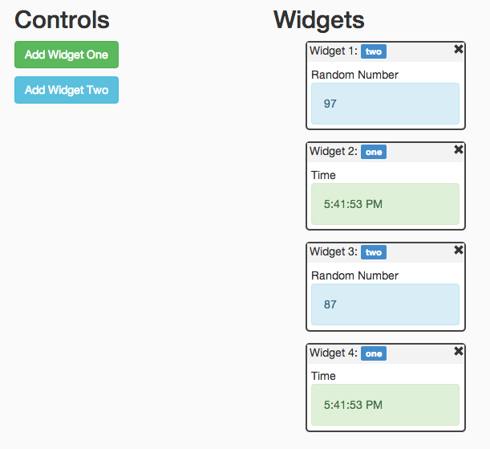

angular-dashboard
=================

**Further development on this project is split into separate repositories:**
 - **[Widget Library](https://github.com/DataTorrent/malhar-angular-widgets)**
 - **[Demo Application](https://github.com/DataTorrent/malhar-dashboard-webapp)**

=================

Dashboard/Widgets functionality with AngularJS (Demo application for [https://github.com/nickholub/angular-ui-dashboard](https://github.com/nickholub/angular-ui-dashboard)).

 Features:

 - Adding/removing widgets

 - Widgets are instantiated dynamically (from corresponding directive or template)

 - Widgets drag and drop (with jQuery UI Sortable)

 - Saving widgets state to local storage

 - Fluid layout (widgets can have percentage width)

 - Any directive can be a widget (e.g. AngularUI directives)

 - Connecting widgets to real-time data (WebSocket, REST, etc.)

 - Changing widget data source dynamically (from widget options)

[Online demo with real-time data](http://nickholub.github.io/angular-dashboard-app)



AngularJS Dashboard directive is available as independent library
[https://github.com/nickholub/angular-ui-dashboard](https://github.com/nickholub/angular-ui-dashboard).

## Running Application (minimum dependencies)

1. Node.js way

 Install express

 ``` bash
    $ npm install express
 ```
 Run Node.js server

 ``` bash
    $ node app.js
 ```
 Application will be available at http://localhost:3000.

2. Simple web server way

 Start any web server in "dist" directory, e.g. with Python
 ``` bash
    $ python -m SimpleHTTPServer 8080
 ```
 Application will be available at http://localhost:8080

In both cases static files (including bundled JS/CSS) will be served from "dist" directory.

## Running Application (development mode)
 Install dependencies:

 ``` bash
    $ npm install
 ```

 Install Bower dependencies:

 ``` bash
    $ bower install
 ```

 Run Grunt server task:

 ``` bash
    $ grunt server
 ```

 Application will be available at http://localhost:9000

## Building Application

 Application is built with Grunt.

 ``` bash
    $ npm install -g grunt-cli
    $ grunt
 ```

## Links

[angular-ui-dashboard](https://github.com/nickholub/angular-ui-dashboard) AngularJS Dashboard directive.

[Node.js](http://nodejs.org/) Software platform built on JavaScript runtime

[AngularJS](http://angularjs.org/) JavaScript framework

[ui-sortable](https://github.com/angular-ui/ui-sortable) AngularJS UI Sortable

[jQuery UI Sortable](http://jqueryui.com/sortable/) jQuery UI Sortable plugin (reordering with drag and drop)

[Bower](http://bower.io/) Package manager for the web

[Grunt](http://gruntjs.com/) JavaScript Task Runner

[Yeoman](http://yeoman.io/) Webapp generator

[DDP](https://github.com/meteor/meteor/blob/master/packages/livedata/DDP.md) Meteor Distributed Data Protocol

[Meteor-DDP](https://github.com/eddflrs/meteor-ddp) Meteor DDP Javascript client